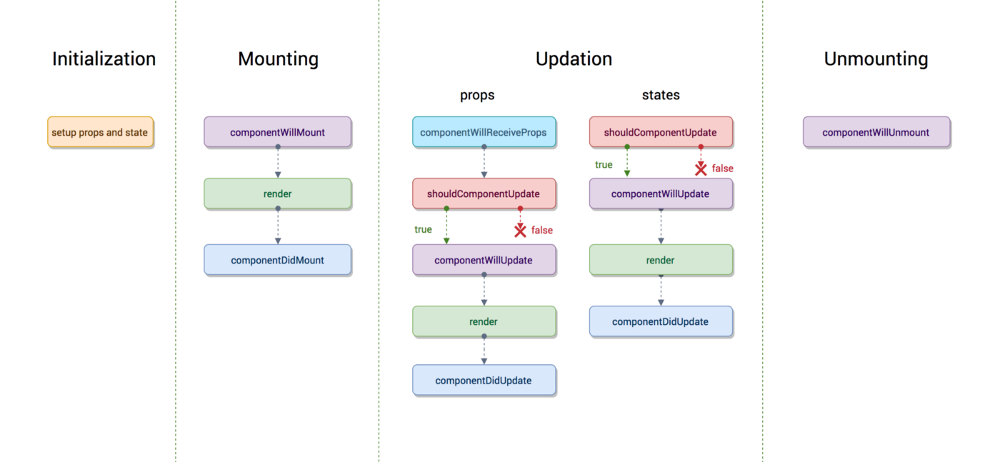

name: title
layout: true
class: middle, center, large

---

name: poll
layout: true
class: large, center-title

{{content}}

.footnote[Vote at PollEv.com/jacquelineas740]

---

name: default
layout: true
class: large, center-title

---

template: title

# React Week 1
## Nuts and Bolts of React and Redux

---

# Summary
- What I did in the past two weeks:
    - Referred to the following resources:
        - *ECMAScript 6 Primer* by Yifeng Luan
        - *React 16 for Everyone* by LUT
        - *Redux and React for Everyone* by LUT
    - Followed two versions of a Movie App Demo
        - One with pure React (Followed and built)
        - One with React and Redux (Followed)

*Familiarize myself with the **usage** of the React and Redux.*
---

template: title

# PART I
## ES6 Features used by React

---

# New Array Operations
Spread Operation:
```js
const east = ["China", "Korea", "Japan"];
const west = ["USA", "Canada", "Britain"];
const countries = [...east, ...west];
//=> [ "China", "Korea", "Japan", "USA", "Canada", "Britain"]
```
Destructuring:
```js
const points = [20, 30, 40];

const [x, y, z] = points;
//=> x = 20, y = 30, z = 40

const [m, , n] = points;
//=> m = 20, n = 40
```
---
# New Object Operation
Data Extraction:
```js
const car = {
  type: 'Toyota',
  color: 'Silver',
  model: 2007
};

const {type, color, model} = car;
//=> type = 'Toyota', color = 'Silver', model = 2007

const {color} = car;
//=> color = 'Silver'
```
---

# New Function Syntax
Arrow Function:
```js
const plus = (a, b) => a+b;
const result = plus(2 + 3);
//=> result = 5;

const printName = (firstName, lastName) => {
  let name = firstName + " " + lastName;
  console.log(name);
  return name;
};
```
Default Param Value:
```js
function greet(name = 'Fellow', greeting = 'Welcome') {
  return greeting + " " + name;
}
```

---

# "Real" Class
```js
class Animal {
  constructor(numLegs) {
    this.numLegs = numLegs;
    this.mammal = false;
  }

  isMammal() {
    this.mammal = true;
  }
}
```
ES6 also introduced two new keywords, `super` and `extends` which are used to extend classes.
- Still different from java class 
    - function prototype under the hood 

---

template: title

# PART II
## Core React Functionalities

---

# Getting Started
CreateReactApp creates a pre-configured project.
```bash
> npm install -g create-react-app
> create-react-app my-project
```
Folder Structure:
* 2 sub-folders: `public` and `src`
* `public` contains `index.html` -- the only html document in the entire project.
* `src` contains (most importantly) `index.js` and `App.js`.
    * `App.js` is the root component of the project.
    * `index.js` renders `App.js` to `index.html`.


---

# Component and JSX
Cornerstone piece of React
```js
import React, { Component } from 'react';

class MyComponent extends Component {
  render() {
    return (
      <div className="MyComponent">
        ... my content
      </div>
    );
  }
}

export default MyComponent;
```
---
* A component is a Class
    * It may contain state.
    * It may have other methods.
    * `render()`is a lifecycle method.
* `render()` returns a single DOM element.
    * defined by JSX (syntactically similar to HTML)
* A component can be nested and reused, just like any default HTML elements.
    * Notice the `import` and `export`.
    * This is what makes React powerful.

---

# Internal and External State of Component
```js
class Welcome extends Component {
  state = { user: { age: 20 } };
  render() {
    return (
      <div className="Welcome">
        <h1>Welcome {this.props.name}</h1>
        <h2>Current User: {this.state.user.age}</h2>
      </div>
    );
  }
}
// used by: <Welcome name="Jane"/>
```
* States passed into a component can be accessed through `props`.
* States maintained within a component can be accessed through any instance variable, typically called `state` object.

---

# Rendering and LifeCycle Methods 
* Data Fetching should be done before `render()`
    * But will trigger update in callback.
* Updates to internal states should call `this.setState()`, in order to trigger update.


---

# Functional Stateless Component
* If a component don't need to keep internal states, it shouldn't be a class. It could just be a function.

```js
const Hello = (props) => (
 <div>Hi $(props.name)</div>
);
```
* `props` are passed in as parameters
* loses all lifecycle methods as well, but not a problem if we don't need them.

---

# React Events and DOM Elements

Dom elements are accessed by `ref`: 
```js
class App extends Component {

  state = { name: "" };
  submit = (e) => {
    this.setState({name: this.myInput.value});
  };

  render() {
    return (
      <div className="App">
        <h2>User Name: {this.state.name}</h2>
        <input type="text" ref = {(item) => this.myInput = item}/>
        <button onClick = {this.submit}>Submit</button>
      </div>
    );
  }
}
```

---

# React Router
imported as a components from a separate package:
```js
import { BrowserRouter as Router, Route} from 'react-router-dom';
```
* `Router` is usually used as root component.
* `Route` matches a `path` string with a component.
* `Switch` is the pattern matching mechanism.

```es6
<Router>
    <Switch>
        <Route path="/test1" component = {Test1}/>
        <Route path="/test2" component = {Test2}/>
        <Route path="/test3" component = {Test3}/>
        <Route path="/" component = {Home} />
    </Switch>
</Router>
```

---

# Styling Components

* The "no brainer" way is to maintain `ComponentName.css` for each `Component`, and import `ComponentName.css` to every `Component.js`.
* A better way is to leverage CSS-in-JS using StyledComponents library.
```js
const MyButton = styled.button`
    margin: 0 1em;
    padding: 0.25em 1em;
    background: palevioletred;
    border-radius: 3px;
`
```
    * Can be reused as components, hence "styled components".

---

template: title

## Demo V1


---

template: title

# PART III
## Core Redux Functionalities

---

# Why (do we need?) Redux?
What if we want to change some state of one component from anywhere in the app?
* e.g. toggle menu, refresh button

What if multiple components need to access the same set of states?
* e.g. is user logged in?

Therefore we need **global state object**
* need to expose `access` and `update` methods to components
* but only the relevant ones. 

---

# Reducer and Action
The basic components of Redux are `reducer` and `action`
* `action` is just an object that contains data:
```es6
const myAction = {
    type = "CHANGE_AGE",
    age = newAge
}
```
* `reducer` is a function that takes in the original state, and an `action`, and then return a **modified** `state`.
```es6
const myReducer = (state, action) => {
    switch(action.type) {
        case 'CHANGE_AGE':
            return { ...state, age = action.age};
        default:
            return state;
    }
}
```

---

# Combine with React
* First write all the reducers, then create a redux store with the combined reducer of all reducers:
```es6
const rootReducer = combineReducers({ toggle, movies, ...});
const store = createStore(rootReducer);
```
* Use `Provider` as root component of the app.
```es6
<Provider store={store}> ... </Provider>
```

*Components access the `store` by "connecting" to the root component, which holds the `store`. They can then use reducers predefined inside it.*


---

# Combine with React (Cont.)
* Components use `connect()` before `export` to access store
```es6
export default connect()(Toggle);
```
* To access states, define a `mapStateToProp` function:
```es6
const mapStateToProps = state => ({
  messageVisibility: state.toggle.messageVisibility,
});
```
* To modify states, define a `mapDispatchToProps`
```es6
const mapDispatchToProps = dispatch => bindActionCreators({
  toggleMessage,
}, dispatch);
```
---
```es6
import React from 'react';
import { connect } from 'react-redux';
import { bindActionCreators } from 'redux';

import { toggleMessage } from './actions';

const Toggle = ({ messageVisibility, toggleMessage }) => (
  <div>
    { messageVisibility &&
      <p>You will be seeing this if redux action is toggled</p> }
    <button onClick={toggleMessage}> Toggle Me </button>
  </div>
);

const mapStateToProps = state => ({
  messageVisibility: state.toggle.messageVisibility,
});

const mapDispatchToProps = dispatch => bindActionCreators({
  toggleMessage,
}, dispatch);

export default connect(mapStateToProps, mapDispatchToProps)(Toggle);
```


---

template: title

## Demo V2


---

# For the next two weeks
- How React and Redux work under the hood
- Focus on **implementation**, instead of usage of React and Redux
    - *Dissecting React & Redux* by Mo Cheng
- Plan for the first Term Project