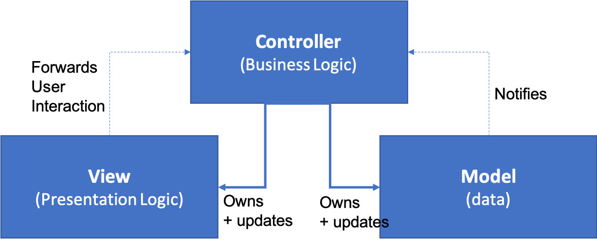
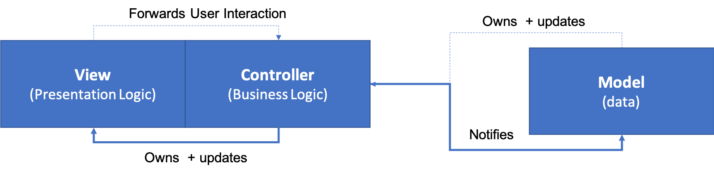

name: title
layout: true
class: middle, center, large

---

name: poll
layout: true
class: large, center-title

{{content}}

.footnote[Vote at PollEv.com/jacquelineas740]

---

name: default
layout: true
class: large, center-title

---

template: title

# iOS Week 2
## Architecture: From MVC to Reactive

---

# Summary
What I did in the past two weeks:
  - Focused on Two Core Architectural Patterns
    - Model-View-Controller
    - Model-View-ViewModel
    - The same app, two different implementations
  - Other iOS Architectural Patterns
    - VIPER
    - Clean Pattern
  - Introduced myself to RxSwift and RxCocoa
    - One Demo

---

template: title

# PART I: MVC and MVVM
## Two Major iOS Architectural Patterns

---
# Model View Controller
* Came front the world of Web Applications:
  * database and database objects are models, 
  * each request is handled by a controller
  * controllers route data to views (HTML/CSS)
  * e.g. Java Spring MVC, Ruby on Rails
* Ideally, the architecture should look like this:
  * 

---

* Yet in reality, the architecture often looks like this:
  * 

* This is because the basic unit of views in iOS comes in the form of ViewController.
  * Everything is set up in ViewControllers. `UIViewController` are `views` as well.
  * No default separation of *presentation logic* from *business logic*.
  * This cause the "massive View Controller" problem.

---

# Using MVC

---

# Model View ViewModel
* Motivation: `ViewModel` to play the role of controllers
  * It is impossible to de-couple Views and Controllers.
  * So use `ViewModel` to hold all the business logic.
* The architecture should look like this:
  * 

---

* `ViewModel` should be a **one-to-one representation** of the View, but it should be independent from `UIKit`.

---
# Using MVVM

---
# Problem: Binding

---
# Solution: `didSet` Closures

---

template: title

# PART II: VIPER
## A less common Architecture

---
# VIPER
* V: View and ViewController

---

---

# Metrics for Measuring Architectures
* Distribution
* Testability
* Ease of Use

---
# Comparison and Conclusion
There is no silver bullet.

---

template: title

# PART III: RxSwift and RxCocoa
## The Reactive Manifesto

---
# The Reactive Manifesto

---
# Basic Ideas: Observable and Observers
* **Observable**

---
# Caution: Disposal

---
# Implementation: BehaviorRelay
* Essentially Box
* 

---
# Syntax: Method Chaining

---
# Result: Out-of-the-box Responsiveness

---
template: title

# The End