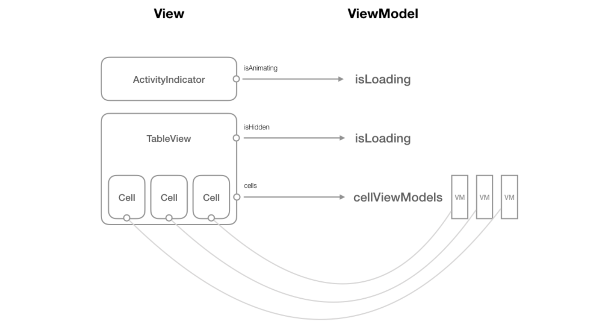
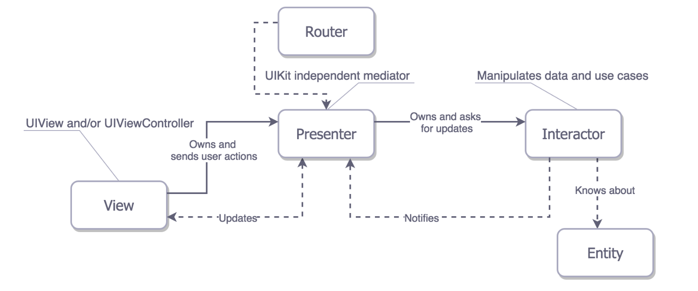
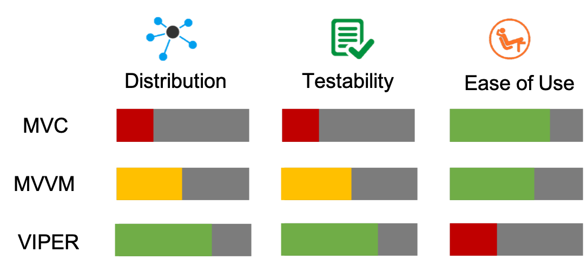

name: title
layout: true
class: middle, center, large

---

name: poll
layout: true
class: large, center-title

{{content}}

.footnote[Vote at PollEv.com/jacquelineas740]

---

name: default
layout: true
class: large, center-title

---

template: title

# iOS Week 2
## Architecture: From MVC to Reactive

---

# Summary
What I did in the past two weeks:
  - Focused on Two Core Architectural Patterns
    - Model-View-Controller
    - Model-View-ViewModel
    - The same app, two different implementations
  - Other iOS Architectural Patterns
    - VIPER
    - Clean Pattern
  - Introduced myself to RxSwift and RxCocoa
    - One Demo

---

template: title

# PART I: MVC and MVVM
## Two Major iOS Architectural Patterns

---
# Model View Controller
* Came front the world of Web Applications:
  * database and database objects are models, 
  * each request is handled by a controller
  * controllers route data to views (HTML/CSS)
  * e.g. Java Spring MVC, Ruby on Rails
* Ideally, the architecture should look like this:
  * 

---

* Yet in reality, the architecture often looks like this:
  * 

* This is because the basic unit of views in iOS comes in the form of ViewController.
  * Everything is set up in ViewControllers. `UIViewController` are `views` as well.
  * No default separation of *presentation logic* from *business logic*.
  * This cause the "massive View Controller" problem.

---

# Using MVC
* **Model:** Data objects and networking services
  * Only responsible for storing states.
  * There can be a `Services` class for data retrieval.
* **View:** UIKit classes responsible for drawing.
  * `UITableViewCell` etc. should not hold data objects
  * They get rerendered by UIViewController
* **Controller:** ViewController
  * Holds all the data objects and view objects
  * Handles user interaction events
  * Calls services to update data
  * rerender View on data change.


---

# Model View ViewModel
* Motivation: `ViewModel` to play the role of controllers
  * It is impossible to de-couple Views and Controllers.
  * So use `ViewModel` to hold all the business logic.
* The architecture should look like this:
  * 

---

* `ViewModel` should be a **one-to-one representation** of the View, 
  * but it should be independent from `UIKit`.
---
# Problem: Binding
* In web applications, controllers binds data to views *once per request*.
* In mobile applications, data in controller and data in views must be in sync *all the time*.
* An update to `ViewModel` must *immediately* trigger update in `View`.
* Solution: Callbacks
---
In `ViewModel`: store coallback closure, and call callback closure on data change:
```swift
class PhotoListViewModel {
    var reloadTableViewClosure : (() -> Void)?
    var updateLoadingStatus : (() -> Void)?
    
    private var cellViewModels: [PhotoListCellViewModel] = [PhotoListCellViewModel]() {
        didSet {
            self.reloadTableViewClosure?()
        }
    }

    var isLoading: Bool = false {
        didSet {
            self.updateLoadingStatus?()
        }
    }
}
```

---
In `ViewController`: predefine callback behavior in lifecycle method `ViewDidLoad`:
```swift
override func viewDidLoad() {
  super.viewDidLoad()

  viewModel.updateLoadingStatus = { [weak self] () in
    DispatchQueue.main.async {
      if (self?.viewModel.isLoading) {
        self?.activityIndicator.startAnimating()
      } else {
        self?.activityIndicator.stopAnimating()
      }
    }
  }
        
  viewModel.reloadTableViewClosure = { [weak self] () in
    DispatchQueue.main.async {
      self?.tableView.reloadData()
    }
  }
}
```

---
# Using MVVM
* `ViewController`s are in the View layer.
* Each `View` object should `own` a corresponding `ViewModel`.
* `ViewModel` should not know which view owns it.
* `ViewModel` should not depend on `UIKit`.
* Data layer is the same as in MVC.

---

template: title

# PART II: VIPER
## A less common Architecture

---
# VIPER
* **V - View**: UIViews and UIViewController subclasses
* **I - Interactor**: contains business logic related to the data (Entity) or networking
* **P - Presenter**:   contains the UI related (but UIKit independent) business logic, invokes methods on the Interactor.
* **R - Router**: responsible for the segues between the VIPER modules.
* **E - Entities**:  your plain data objects, not the data access layer.

---

* A VIPER module can be a one screen or the whole user story of your application .
* Key differences compared with *MV-X*:
  * data interaction logic gets saparated from data objects
  * VIPER is the first pattern which explicitly addresses navigation responsibility with Router.

---

# Metrics for Measuring Architectures
* **Distribution:** The number of components that can grow/extend independently without conflict.
  * Single Responsibility Principle
  * Allow *distribution* of work to different teams.
* **Testability:** Easy to verify whether each component performs its desired responsibility.
* **Ease of Use:** Does not require too much setup/maintenance to work with.

---
# Comparison and Conclusion

* Conclusion: there is no silver bullet. 
  * Small project may choose MVC.
  * Industry standard is MVVM.

---


template: title

# PART III: RxSwift and RxCocoa
## The Reactive Manifesto

---
# The Reactive Manifesto
Systems conforming to the Reactive Manifesto are:
* **Responsive:** rapid and consistent response to requests/changes
* **Message Driven:** components are loosely coupled, but may communicate through message passing.

ReactiveX is a combination of the best ideas from:
* the Observer pattern, 
* the Iterator pattern, 
* and functional programming

---
# Basic Patterns
1. Data Source objects / collections create event streams or data streams.
2. Event streams are than processed / enhanced
3. Components interested in the data *subscribes* to the stream
   * react whenever there is a `next` object or change.

Everything in RxSwift is
* either an observable sequence
* or an operator on sequences
* or a subscriber to observable sequences.


---
# Basic Ideas: Observable and Observers
* `Observable` transforms data (obj / collection) into event streams.
* An event stream is a sequence that `emit`s data.
* Observable sequences can emit zero or more events over their lifetimes. 
* There are three types of events
  * `.next(value: T) `: the value of a data object.
  * `.error(error: Error)`: terminate with error.
  * `.completed `: end of stream signal.
* Different subclasses of `Observable` defines different behaviors of `emit`.
  * e.g.: `BehaviorRelay` emits the most-recent data.

---
# Basic Ideas: Subscribers
* Objects **subscribe to** observable sequences by calling 
`subscribe(on:(Event<T>)-> ())`.
```swift
let helloSequence = Observable.from(["H","e","l","l","o"])
let subscription = helloSequence.subscribe { event in
  switch event {
      case .next(let value):
          print(value)
      case .error(let error):
          print(error)
      case .completed:
          print("completed")
  }
}
//=> H e l l o completed
```

---
# Caution: Disposal
* When a subscriber wishes to cancel a subscription, it can do that by calling 
`dispose`.
* **Caution:** before a stream `deinit`, all its subscribers must cancel subscription.
  * Otherwise: Memory Leak
  * ARC: reference `!= 0`
* To automate cancelling, we use a `DisposeBag`
```swift
let bag = DisposeBag()
...
subscription.addDisposableTo(bag)
```
---
# BehaviorRelay under the Hood
```swift
class BehaviorRelay<T> {
  typealias Listener = T -> Void
  var listeners = [Listener?]()

  var value: T {
    didSet {
      for l in listeners { l(value) }
    }
  }

  init(_ value: T) { self.value = value }

  func subscribe(l: Listner?) {
    self.listeners.append(l)
    l?(value)
  }
}
...
let dataStream = BehaviorRelay([DataItem]())
``` 


---
# Recap: Not an Architectural Pattern
* RxSwift represents a programming paradigm, not an architectural pattern
  * oriented around data flows and the propagation of change.
* Even with RxSwift, we still need to decide which architectural pattern to use.

---
template: title

# The End